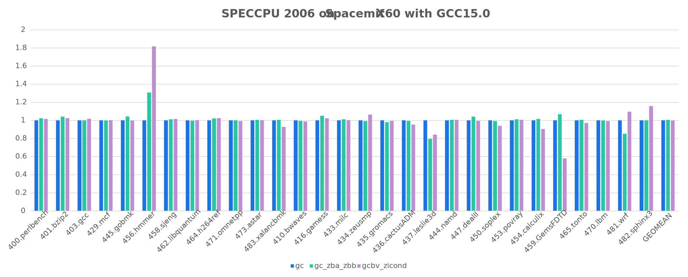
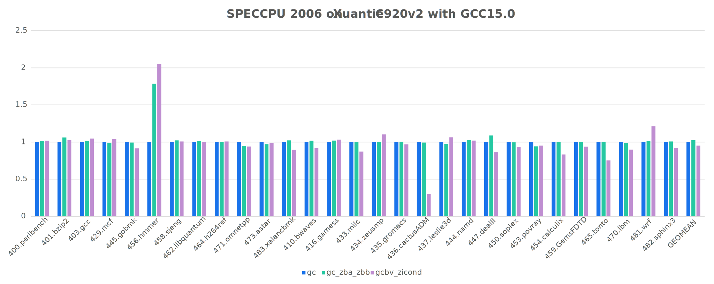
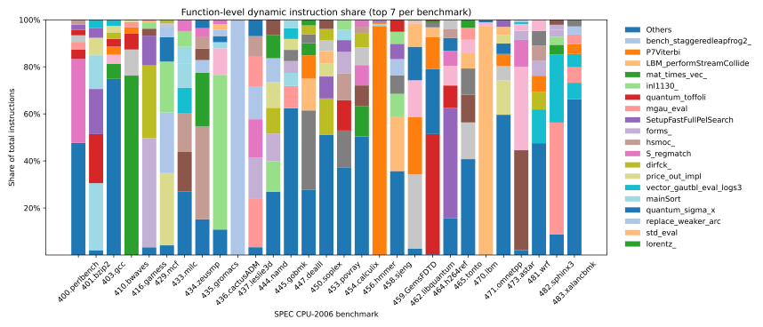
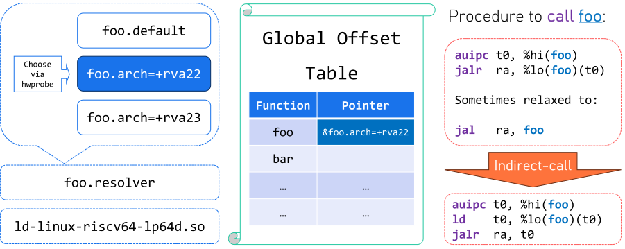
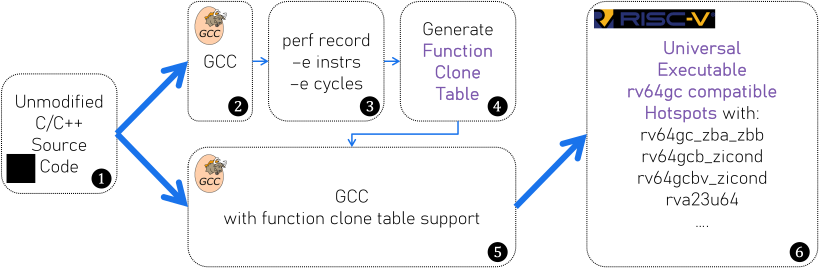
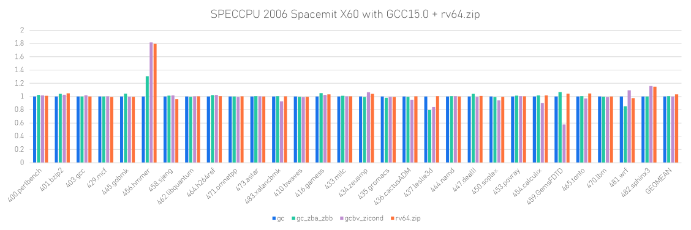
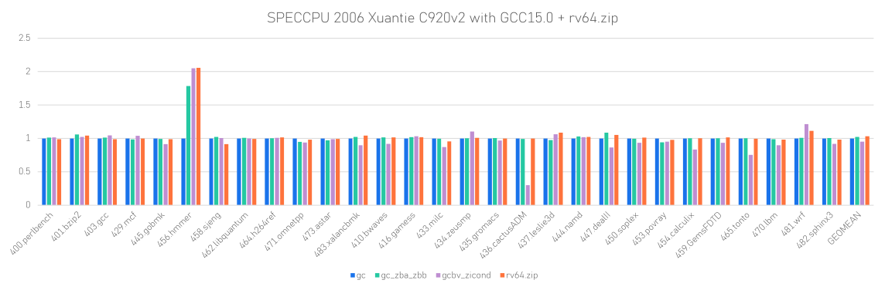

# Intro

This project aims to provide a way for RISC-V (and even for x86-64 and aarch64) developers to build a universal binary that:

- Leverages the latest ISA extensions, such as vector and even RVA23U64
- Maintains compatibility with the RV64GC base ISA
- Achieves even **higher** performance compared to most ISA coverage binaries by dropping some extensions that hinder performance

## Background

### Fragmented RISC-V ISA Ecosystem

Our dream: RVA23U64

Existing hardware:

| Microarchitecture | Real chip come to market | RVA Profile | Additional Important Extensions |
|-------------------|--------------------------|-------------|---------------------------------|
| Sifive U74        | 2022 (StarFive JH7110)   | RVA20U64    | Zba, Zbb                        |
| Xuantie C910      | 2023 (TH1520)            | RVA20U64    | xthead*                         |
| Xuantie C920      | 2023 (SG2042)            | RVA20U64    | xthead*                         |
| SiFive P550       | 2024 (ESWIN EIC7700X)    | RVA20U64    | Zba, Zbb                        |
| XiangShan Nanhu V2| 2024                     | RVA20U64    | Zba, Zbb, Zbs                   |
| Spacemit X60      | 2024 (Spacemit K1)       | RVA22U64    | Vector, Zicond                  |
| Xuantie C920v2    |                          | RVA22U64    | Vector, Zicond, Zfa, Zawrs      |

Throughout the RISC-V ecosystem, there are many different ISA extensions and profiles, which can lead to fragmentation and compatibility issues. From this table, we observe that some microarchitectures support some useful extensions that largely improve performance, such as vector and zbb, but the next generation of RVA profiles requires some additional extensions which are not supported by the current hardware. Thus, if we only rely on the RVA profiles rather than the real hardware capabilities, we may not be able to fully utilize the hardware's potential.

### Software distribution does not leverage the hardware capabilities

Most binary distribution: RV64GC (RVA20U64)

Some software do manually function multi-version dispatching:

- [OpenSSL](https://github.com/openssl/openssl/commit/66ad636b979554ddde5cd5908feabda79d07317b)

- [FFmpeg](https://github.com/FFmpeg/FFmpeg/commit/95d1052fba671d6c4ab6727a6905a637d03211c7)

- [GLIBC](https://github.com/bminor/glibc/commit/2149da36836bc32cd66359ca37bab5884af7e81f)

### RVA23 distro is not as beautiful as your imagination

#### Performance degradation even worse than RV64GC

This could happens while compiler and CPU does not well tuned for latest extensions.





In our evaluation using GCC15.0 using `-O3` optimization with different `-march` options, we found that the performance of the `rv64gcbv_zicond` binary is even slower than the `rv64gc` binary on the C920v2 (by 5%) and Spacemit X60 (by less than 1%), with maximum **3.34x slowdown** on 436.cactusADM on C920v2. This is likely due to the fact that the compiler and CPU are not well tuned for the latest extensions.

Notably, RISC-V is not alone, such performance degradation also happens on other architectures, such as aarch64 and x86-64, especially for [SVE2 extension on aarch64 with GCC14.2 + O3](https://blog.cyyself.name/wp-content/uploads/2025/02/Screenshot-2025-02-09-at-19.17.59.png).

## New opportunity



From our discovery, we found that there are only a few of function hotspots that dominate the execution time even in CPU benchmarks. Here we use different color to distinguish different function. The length of the bar represents the dynamic instruction count of the function in a single benchmark. And the bottom blue bar represents the hotness other functions except the top 7 functions, since they are relatively small in most benchmarks, thus we can only focus on the top functions to generate different versions of the binary for different hardware capabilities, thereby optimizing the performance of the binary on different hardware configurations. We can also drop the new extensions that hinder performance, to achieve even higher performance compared to the most ISA-compliant binary. Thus, we can have a more tailored and efficient binary for each specific hardware configuration.

## Why existing solution fails

RISC-V is not the first architecture that has this problem, and there are already some solutions for other architectures, such as aarch64 and x86-64. However, these solutions are not widely used for some reasons:

### Rarely used target_clones attributes

```c
__attribute__((target_clones("default", "arch=+zba,+zbb", "arch=+b,+v,+zicond")))
void foo() { ... }
```

The `target` and `target_clones` attribute in GCC [dates back to 2012](https://github.com/gcc-mirror/gcc/commit/3649b9b791c54f35a8bfb5540711dc4112acce7d) just after AVX extension on x86-64 was introduced. And you can use it on RISC-V since GCC 15.0 and LLVM 20.1, but it is rarely used in practice. It allows developers to specify multiple versions of a function for different hardware capabilities, but it has some limitations:

- It requires the source code to be modified, which is not always feasible for large codebases or third-party libraries.

    Alternatively, you can use many `#ifdef` to handle the portability for different target and different compiler, but it makes the code messy and hard to maintain.

- It does not support automatic generation of multiple versions of a binary, developers have to manually create and maintain these versions through their knowledge of each architecture and its extensions.

### Indirect call overhead



When using `target_clones` or `target_version`, the compiler will use GNU IFUNC to dispatch the function call to the correct version at runtime. This introduces an overhead of an indirect function call, and also refuses some optimizations such as inlining. When compiling without `-fno-plt` or with `-fno-pic`, things will be worse since it requires 2 level call to the function (the first level is PLT call).

## Solution

We propose a set of solutions to address the above issues and provide a way to build a universal binary that can leverage the latest ISA extensions while maintaining compatibility with the RV64GC base ISA.

### Decoupled function clone table

We introduce [a new option `-ftarget-clones-table` in compiler](https://patchwork.sourceware.org/project/gcc/list/?series=49088&state=*), which allows developers to specify a JSON format table of target clones for every target, which look like this:

```json
{
  "foo": {
    "x86_64": ["avx2", "avx512f"],
    "riscv64": ["arch=+v", "arch=+zba,+zbb"]
  }
  "bar": {
    "x86_64": ["popcnt"],
    "aarch64": ["sve2"]
  }
}
```

This allows developers to specify multiple versions of a function for different hardware capabilities without modifying the source code.

### Automatic function clone table generation

- A straightforward way:
    - Use linux-perf to record the running cycles of each function on different extensions with the same input
    - Generate function clone table based on perf result

- A more advanced way:
    - It's my own [research project](/research/).

### Indirect-calling overhead

#### Compiler side

- Direct call to compatible version function

    We can use a direct call to the target version function if the target version is compatible with the current multi-versioning function, which is implemented in GCC [here](https://patchwork.sourceware.org/project/gcc/list/?series=46245&state=*). This is useful for performance-critical code that uses function multi-versioning and works well with LTO optimizations.


#### CPU side

- Better indirect branch prediction

    We should have better CPU support for indirect branch prediction. However, it's not a big problem since most CPUs today using decoupled frontend, which no matter a branch is direct or indirect. It only adds 1-2 instructions to the backend pipeline, which is negligible.

### Summary



## Evaluation

Finally, we only cloned 55 functions from the entire SPEC CPU 2006 benchmark. By running the SPECCPU 2006 benchmark with the universal rv64.zip binary, we achieved a performance improvement of 3.2% on both Spacemit X60 and Xuantie C920v2 compared to the base RV64GC binary. And we even outperformed the `rv64gcbv_zicond` binary by 3.2% on Spacemit X60 and 8.4% on Xuantie C920v2, which is compiled with `-march=rv64gcbv_zicond` and `-O3` optimization.





## Conclusion

- Discussed the need for better function multi-versioning
- How: Compile => Perf Record => Clone Table => Compile
- Evaluated with CoreMark and SPECCPU 2006
    - Outperforms most possible ISA extensions
    - Retaining binary compatibility with base RV64GC

## Future Work

Except from the research to automatically generate the function clone table, we also have some future work to do:

### rv64.zip Distro

Since most ISA coverage binaries are not well optimized because the compiler and CPU are not well tuned for the latest extensions, we can build a distro that leverages the latest ISA extensions and provides a better performance than most ISA coverage binaries via rv64.zip.

First, we need to profiling the software and find the hotspots, and try with different ISA extensions to find the best performance on current hardware, and generate the function clone table based on the profiling result.

Then, as a distro, we can maintain such a function clone table in our repo, and add `-ftarget-clones-table=such-table.json` option to the compiler when building the software, we will get a universal binary that:

- Leverages the latest ISA extensions, such as vector and even RVA23U64
- Maintains compatibility with the RV64GC base ISA
- Achieves even **higher** performance compared to most ISA coverage binaries by dropping some extensions that hinder performance
